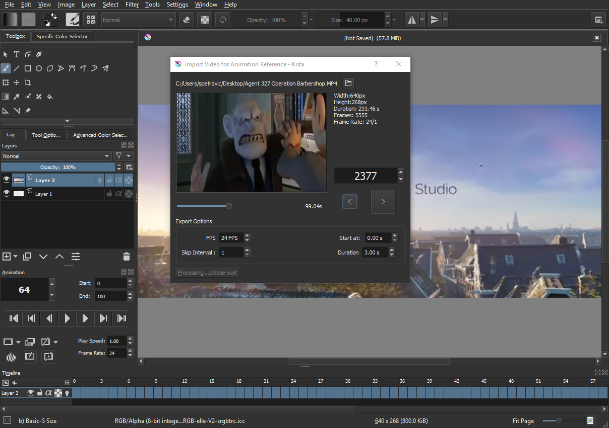

# Animator Video Reference Plugin

UPDATE 03/13/2023: This plugin is now natively part of Krita as of Krita 5.0. I will keep this code here for reference, but you don't need to install this plugin any longer to get this functionality. It is built-into the application now. This code will not be updated or maintained in the future.

A Python plugin for Krita 4.2 that allows you to load a video for reference and import frames to your document.

# Installation
You need to have FFMPEG installed/hooked up for this to work. This is generally needed to do things with animation in Krita and does most of the work for this plugin. If you haven't done that, see the instructions for the official documentation.

https://docs.krita.org/en/reference_manual/render_animation.html#setting-up-krita-for-exporting-animations

Once you have that working, then continue. Download the plugin as a ZIP file from the "Clone or Download" option on this page. Krita 4.2 comes with a python script importer to make it easy to add. After the zip file is done, start Krita. Go to...

Tools > Scripts > Import Python Plugin

Select the zip file to upload. You will have to restart Krita for the plugin to show up in your plugin manager. Settings > Configure Krita > Python Plugin Manager. Make sure it is enabled and click OK.

Note to Windows users: the python script uses the command line for working with the video. ffmpeg needs to be found from the command line for this to work. This means you need to add ffmpeg to your environment variables. See this video on how to set it up if you don't know how to do that... https://www.youtube.com/watch?v=yKJFKHT6bzA

# Usage
This script is started from the main menu Tools > Animator Video Reference. Once the window loads, select a file. The video loads a thumbnail where you can scrub through the timeline. You can also export out a frame range so it goes into a new Krita document and populate the timeline

You can see an example from this youtube video going over it... https://www.youtube.com/watch?v=VsYGtPXgJIg&t=12s
